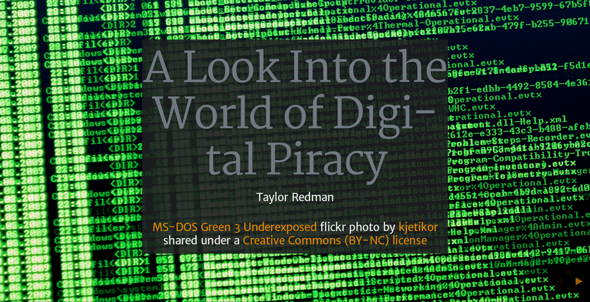

# fs102S2017-Presentation1-taylor-redman



This repository contains the HTML source code and additional resources for our second presentation in our FS 102 class, Software Everywhere.

Here is a live link to publicly view the slide presentation:
[A Look into the World of Digital Piracy
](https://rawgit.com/taylor-redman/fs102S2017-Presentation2-taylor-redman/master/sbst2016_position.html).

## Installation Instructions

You can type the following command if you want to clone this repository:

```shell
git clone https://github.com/taylor-redman/fs102S2017-Presentation2-taylor-redman.git
```
